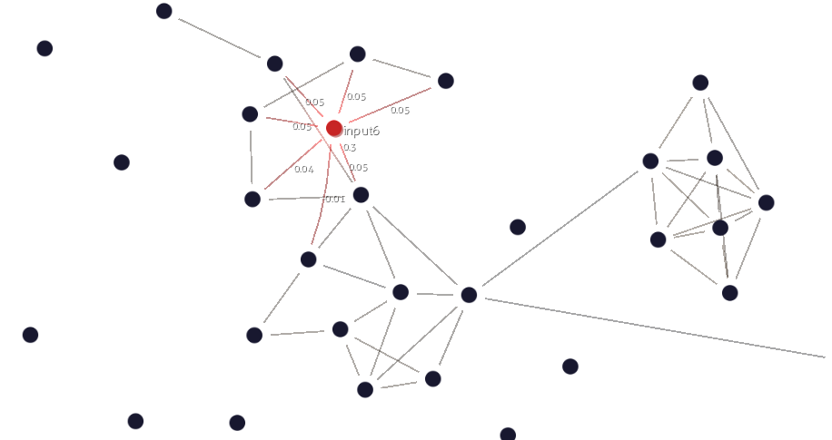

Associative Memory
==================



This project is two-fold: `libassociative-memory`, a associative memory network,
and `memory-view`, an OpenGL-based real-time viewer for this memory network.

libassociative-memory
---------------------

`libassociative-memory` is a small library that implements an associative memory
network. Its formulation is based on a paper by Baxter et al.: [Modelling
Concept Prototype Competencies using a Developmental Memory
Model](dx.doi.org/10.2478/s13230-013-0105-9).

This library is available under the terms of the [Apache v2](LICENSE) license.

memory-view
-----------


`memory-view` is an OpenGL-based viewer for associative memory networks,
released under the [GPLv3](src-viz/LICENSE) license.


It is essentially a force-directed 2D graph that can be zoomed/panned with the
mouse.

Documentation:
```
memory-view --help
```

The code is originally based on Gource, by Andrew Caudwell.
